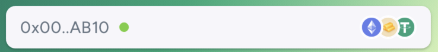
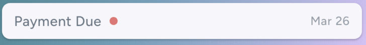
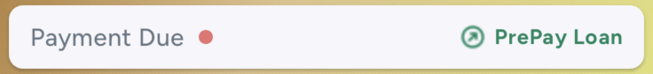
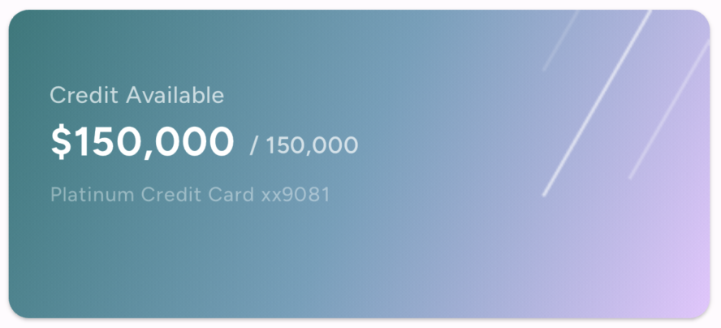

# DTCC Task

This is a server-driven UI screen for a fintech application made with [Flutter](https://docs.flutter.dev/) and [Mirai](https://github.com/Securrency-OSS/mirai).
Here the application UI is created from the response received form the server in the form of JSON.

## Setup
This project is developed on below mentioned versions of required SDK and IDE(s)
` Flutter SDK 3.19.5 and Dart 3.3.3`
`Xcode: 15.3`
`Android Studio Hedgehog | 2023.1.1`

Here [Freezed](https://pub.dev/packages/freezed) is used to generate the models and [json_serializable](https://pub.dev/packages/json_serializable) is used to serialize and deserialize the JSON data.
The generated files are not checked in the repository, so you need to run the below command to generate the files.
```bash
dart run build_runner build
```

## Project Structure
* The File name starting with `_ (underscore)` are used as export files.

The project is divided into below mentioned directories:
- `lib` : Contains the main codebase of the application.
  - `constants` : Contains the constants used in the application.
    - `_constants` : Used as export file for all the constants.`
    - `app_color_palette` : Contains the color palette used in the application.
    - `app_dimens` : Contains the dimensions used in the application (like radius, horizontal spacings, vertical spacings)
    - `app_font_sizes` : Contains the font sizes used in the application (like small, medium, large)
    - `app_strings` : Contains the strings used in the application.
    - `assets` : Contains the images used in the application.
  
  - `ui` : Contains all the data related to create UI (widgets) in the application
    - `external_widgets` : Contains the external widgets used in the application, external widgets are the widgets that are dependant on external libraries.
    - `internal_widgets` : Contains the internal widgets used in the application, internal widgets are the widgets that are created in the application and are used in multiple places.
    - `sd_widgets` : Contains the server-driven widgets used in the application, server-driven widgets are the widgets that are created based on the response received from the server.
  
  - `utils` : Contains the utility classes used in the application.

  - `main.dart` : The entry point of the application.

## JSON Structure
As per the response fetched from the below mentioned API, the UI is created and the data is populated in the widgets.

###### API Link
```
https://flutter-task-19599-default-rtdb.firebaseio.com/test/data.json
```

```json
{
  "type": "scaffold",
  "appBar": ...,
  "body": ...,
}
```

This structure creates a scaffold with an app bar and a body. 

#### AppBar
```json
{
  "appBar": {
    "type": "appBar",
    "leading": {
      "child": {
        "backgroundImage": "https://pbs.twimg.com/profile_images/1747647475307909121/jdZb8gnX_400x400.jpg",
        "type": "circleAvatar"
      },
      "padding": 8,
      "type": "padding"
    },
    "title": {
      "type": "row",
      "children": [
        {
          "data": "Hello",
          "style": {
            "color": "#232427",
            "fontSize": 16,
            "fontWeight": "w700"
          },
          "type": "text"
        },
        {
          "type": "sizedBox",
          "width": 6
        },
        {
          "data": "Alexander",
          "style": {
            "color": "#687684",
            "fontSize": 16,
            "fontWeight": "w400"
          },
          "type": "text"
        }
      ],
      
    },
    
  },
}
```
This creates an APP bar with a leading circle avatar with background image fetched from the network and a title with two text widgets and a SizedBox of width 6 in between the text widgets, in a Row.

#### Body
```json
{
  "body": {
    "type": "listView",
    "children": [
      {
        "assets": [
          "ETH",
          "LiGold",
          "USDT"
        ],
        "cardName": "Wealth Account",
        "cardTitle": "Networth",
        "increment": "+9.18%",
        "networth": 64000.9,
        "type": "accountCard",
        "walletAddress": "0x00..AB10"
      },
      {
        "availableCredit": "$64,500.90",
        "cardName": "Platinum Credit Card",
        "cardNumber": "xx9081",
        "cardTitle": "Credit Available",
        "dueDate": 1711467311,
        "totalCredit": "$1,50,000",
        "type": "creditCard"
      },
      {
        "cardName": "Asset loan",
        "cardTitle": "Remaining loan",
        "plan": "36M Plan",
        "remainingBalance": "$104,000",
        "totalLoan": "$300,000",
        "type": "loanCard"
      }
    ],
    "separator": {
      "height": 16,
      "type": "sizedBox"
    },
  },
}
```
This creates a ListView with 3 children, each child is a card with different data. The first card is an AccountCard with 3 assets, a card name, a card title, an increment, a networth, and a wallet address. The second card is a CreditCard with available credit, card name, card number, card title, due date, and total credit. The third card is a LoanCard with a card name, card title, plan, remaining balance, and total loan.

The above cards `accountCard`, `creditCard`, and `loanCard` are parsed within the application as these are custom widgets created in the application and the respective data for the same are present inside the `lib/ui/sd_widgets` directory.

`CardWidget` is the parent widget for all the cards and the respective data is passed to the `CardWidget` and the respective card is created based on the data passed and `AccountCardWidget`, `CreditCardWidget`, and `LoanCardWidget` are individual widgets extending the `CardWidget` and have their own parsed and data model which are populated from the server's response based on the type. 

## Screenshots

 
## Assumptions 
- The currency is assumed to be in `USD` and the respective currency format is used to display the currency in the application.

- The indicator in the footer widget of Every Card is assumed to be positive or negative asset, if the asset is positive the green indicator is shown and if the asset is negative the red indicator is shown.
  
For the above images, the first image is the positive asset and the second image is the negative asset.
For CreditCard and LoanCard the `PaymentDue` Footer is only shown if the asset is negative.
  - For AccountCard, the increment is calculated as 
  ```increment.contains('+')``` If the increment is positive or not
  - For Credit card, this is calculated as  
  ```totalCredit.toDouble / availableCredit.toDouble <= 1.0;```
  
  - For Loan card, this is calculated as
  ```totalLoan.toDouble / remainingBalance.toDouble <= 1.0;```
- The font family used here is [Figtree](https://fonts.google.com/specimen/Figtree) and the same is passed to `Mirai`
```dart
class AppStrings {
  const AppStrings._();
  static const String fontFamily = 'Figtree';
}
  
  MiraiApp(
      theme: const MiraiTheme(fontFamily: AppStrings.fontFamily),
      darkTheme: const MiraiTheme(fontFamily: AppStrings.fontFamily),
      homeBuilder: ...
  );
```


## Libraries Used
- [mirai](https://pub.dev/packages/mirai) : Used to create the server-driven UI in the application.
- [avatar_stack](https://pub.dev/packages/avatar_stack) : Used to create the stack in widgets overlapping each other the application, this is used int eh AccountCard Footer widget to show the multiple assets user has.
- [freezed](https://pub.dev/packages/freezed) | [freezed_annotation](https://pub.dev/packages/freezed_annotation) | [json_serializable](https://pub.dev/packages/json_serializable) | [json_annotation](https://pub.dev/packages/json_annotation) | [build_runner](https://pub.dev/packages/build_runner): These libraries are collectively used to generate the models and serialize and deserialize the JSON data.
- [intl](https://pub.dev/packages/intl) : Used to format the date in the application.
